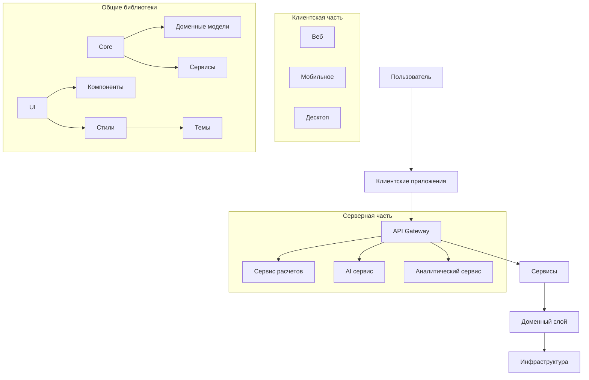

// README.md
// Главный файл документации проекта Marketplace Tools
// Описание: Основная точка входа для документации проекта
// Логика: Клиентская и серверная части
// Зависимости: Все пакеты и сервисы проекта

# 🚀 Marketplace Tools
[](https://opensource.org/licenses/MIT)
[](https://prettier.io/)
[](http://commitizen.github.io/cz-cli/)
[](https://conventionalcommits.org)

## 📋 Описание проекта

**WB Calculator** - это веб-приложение для расчета доходности товаров на маркетплейсе Wildberries с использованием реального API.

### Основные возможности

- 🔍 **Поиск товаров WB** - интеграция с официальным API Wildberries
- 📊 **Расчет доходности** - автоматизированные расчеты прибыли и рентабельности
- 🎨 **Современный UI** - Material-UI компоненты с адаптивным дизайном
- ⚡ **Быстрый поиск** - автодополнение и подсказки при вводе
- 📱 **Адаптивность** - поддержка всех устройств и экранов
- 🎯 **TypeScript** - строгая типизация для надежности кода

## 🏗️ Архитектура проекта

Проект построен по принципам **чистой архитектуры** и **DDD** (Domain-Driven Design) с четким разделением на слои:


### Ключевые компоненты

1. **Клиентские приложения** (`/app`)
   - `web/` - PWA на React + TypeScript
   - `mobile/` - Кросс-платменное приложение на React Native
   - `desktop/` - Десктопное приложение на Electron

2. **Серверные сервисы** (`/services`)
   - `api-gateway/` - Единая точка входа для API
   - `calculator-service/` - Логика расчетов
   - `ai-service/` - AI/ML функционал

3. **Библиотеки** (`/packages`)
   - `core/` - Бизнес-логика и доменные модели
   - `ui/` - Компоненты интерфейса
   - `config/` - Конфигурация приложений

4. **Инфраструктура** (`/infrastructure`)
   - `database/` - Миграции и сиды
   - `logging/` - Централизованное логирование
   - `deployment/` - Деплой и оркестрация

## 🎯 Текущие возможности (после последнего обновления)

### ✅ Реализованный функционал

**🔍 Поиск товаров Wildberries:**
- Интеграция с официальным API WB
- Автодополнение и подсказки поиска
- Прогресс-бар загрузки
- Отображение карточек товаров с реальными данными

**🎨 Интерфейс:**
- Современный Material-UI дизайн
- Адаптивная верстка для всех устройств
- Анимации и hover эффекты
- Темная/светлая тема

**🏗️ Архитектура:**
- Разделение на компоненты для лучшей организации
- Кастомные хуки для бизнес-логики
- TypeScript для типобезопасности
- React Router для навигации

**📱 Доступные страницы:**
- `/` - Главная с приветствием и навигацией
- `/search` - Основной поиск товаров WB
- `/wb-search` - Альтернативный маршрут поиска
- `/analytics` - Страница аналитики (в разработке)
- `/components` - Демонстрация компонентов

## 🚀 Быстрый старт

### 🛠️ Требования к окружению

- **Node.js**: 18+ (рекомендуется LTS)
- **Менеджер пакетов**: npm 8+ или pnpm 7+
- **Git**: 2.20+
- **Docker**: 20.10+ (опционально, для контейнеризации)
- **База данных**: PostgreSQL 13+ / MongoDB 5.0+

### ⚙️ Установка и настройка

1. **Клонирование репозитория**
   ```bash
   # Клонирование с подмодулями
   git clone --recurse-submodules https://github.com/your-username/wb-calc.git
   cd wb-calc
   ```

2. **Установка зависимостей**
   ```bash
   # Установка корневых зависимостей
   npm install
   
   # Инициализация подмодулей
   git submodule update --init --recursive
   
   # Установка зависимостей для всех пакетов
   npm run bootstrap
   ```

3. **Настройка окружения**
   ```bash
   # Копирование примеров конфигурационных файлов
   cp .env.example .env
   cp .env.development.example .env.development
   
   # Настройка переменных окружения
   # Отредактируйте файлы .env и .env.development
   # Обратите внимание на настройки базы данных и API ключи
   ```

4. **Инициализация базы данных**
   ```bash
   # Запуск миграций
   npm run db:migrate
   
   # Загрузка тестовых данных (опционально)
   npm run db:seed
   ```

## 🚀 Запуск в режиме разработки

### Текущая настройка (после рефакторинга)

Проект теперь использует упрощенную архитектуру с фокусом на веб-приложение:

#### Веб-приложение (основной фокус)
```bash
cd app/web
npm run dev  # Запуск на http://localhost:5215
```

#### Доступ к страницам после запуска:
- **Главная страница**: http://localhost:5215/
- **Поиск товаров WB**: http://localhost:5215/search
- **Аналитика**: http://localhost:5215/analytics
- **Компоненты**: http://localhost:5215/components

### Структура проекта после рефакторинга

После разделения монолитного App.tsx на компоненты, структура стала более организованной:

```
src/
├── components/          # Разделенные компоненты страниц
│   ├── HomePage.tsx     # Главная страница
│   ├── ProductSearchPage.tsx # Поиск товаров WB
│   ├── AnalyticsPage.tsx # Аналитика
│   ├── ProductCard.tsx  # Карточки товаров
│   └── ProgressBar.tsx  # Индикаторы прогресса
├── hooks/               # Кастомные хуки
│   └── useWildberriesSearch.ts # Логика поиска WB
├── services/            # API сервисы
│   └── wildberries.ts   # Интеграция с WB API
└── App.tsx              # Главный роутер (значительно уменьшен)
```

## 🛠 Доступные скрипты

### Основные команды

```bash
# Установка зависимостей
npm install           # Установка корневых зависимостей
npm run bootstrap    # Установка зависимостей для всех пакетов

# Запуск в режиме разработки
npm run dev          # Запуск веб-приложения и API
npm run dev:all      # Запуск всего стека через Docker

# Сборка проекта
npm run build        # Сборка всех пакетов
npm run build:prod   # Продакшн сборка

# Тестирование
npm test             # Запуск всех тестов
npm run test:watch   # Запуск тестов в режиме watch
npm run test:cov     # Покрытие кода тестами
npm run test:e2e     # E2E тесты

# Линтинг и форматирование
npm run lint         # Проверка стиля кода
npm run format       # Форматирование кода
npm run type-check   # Проверка типов TypeScript

# Работа с базой данных
npm run db:migrate   # Применение миграций
npm run db:rollback  # Откат последней миграции
npm run db:seed      # Заполнение тестовыми данными

# Деплой
npm run deploy:staging    # Деплой на staging окружение
npm run deploy:production # Деплой на production
```

### Git Hooks

Проект использует Husky для автоматического запуска проверок перед коммитом:
- **pre-commit**: Запуск линтера и форматтера
- **commit-msg**: Проверка сообщения коммита на соответствие Conventional Commits
- **pre-push**: Запуск тестов

Для создания осмысленных коммитов используйте:
```bash
npm run commit
```

### Конфигурация IDE

Рекомендуемые настройки для VS Code:
1. Установите расширения:
   - ESLint
   - Prettier
   - EditorConfig
   - Stylelint
   - DotENV

2. Включите автосохранение и форматирование при сохранении:
   ```json
   {
     "editor.formatOnSave": true,
     "editor.codeActionsOnSave": {
       "source.fixAll.eslint": true
     },
     "eslint.validate": ["javascript", "typescript", "typescriptreact"]
   }
   ```

## 📦 Основные пакеты

### @wb-calc/config

**Централизованная система конфигурации**

```typescript
import { config } from '@wb-calc/config';

// Использование конфигурации
const apiConfig = config.get('api');
const isProduction = config.get('env') === 'production';
```

**Ключевые особенности:**
- Загрузка из `.env`, JSON, YAML, удаленных источников
- Строгая типизация с TypeScript
- Валидация через Zod схемы
- Горячая перезагрузка конфигурации

**Пример схемы конфигурации:**
```typescript
// schemas/database.ts
export const databaseSchema = z.object({
  host: z.string().default('localhost'),
  port: z.number().default(5432),
  name: z.string(),
  user: z.string(),
  password: z.string(),
  ssl: z.boolean().default(false)
});
```

### @wb-calc/core

**Бизнес-логика и доменные модели**

Основные сущности:
- `Product` - Товар с ценами и характеристиками
- `Order` - Заказ с позициями
- `Calculation` - Результаты расчетов
- `User` - Пользователь системы

**Пример использования:**
```typescript
import { Product, Calculator } from '@wb-calc/core';

const product = new Product({
  id: '123',
  name: 'Смартфон',
  purchasePrice: 15000,
  sellingPrice: 25000,
  quantity: 10
});

const calculator = new Calculator();
const profit = calculator.calculateProfit(product);
```

### @wb-calc/ui

**Библиотека UI компонентов**

```typescript
import { Button, Input, Card, useTheme } from '@wb-calc/ui';

function ProductCard({ product }) {
  const theme = useTheme();
  
  return (
    <Card>
      <h3>{product.name}</h3>
      <Input 
        value={product.price} 
        onChange={(e) => updatePrice(product.id, e.target.value)}
      />
      <Button variant="primary">Сохранить</Button>
    </Card>
  );
}
```

**Доступные компоненты:**
- `Button` - Кнопки разных типов и размеров
- `Input` - Поля ввода с валидацией
- `Table` - Таблицы с сортировкой и пагинацией
- `Modal` - Модальные окна
- `Form` - Формы с валидацией
- `Notification` - Уведомления
- `ThemeProvider` - Провайдер тем

**Темы:**
- Светлая (по умолчанию)
- Темная
- Высокий контраст (для доступности)

## 🐳 Docker

### Сборка образов

```bash
# Сборка всех сервисов
docker-compose build

# Сборка конкретного сервиса
docker-compose build api-gateway
```

### Запуск

```bash
# Запуск в фоновом режиме
docker-compose up -d

# Просмотр логов
docker-compose logs -f
```

## 🧪 Тестирование

### Запуск тестов

```bash
# Запуск всех тестов
npm test

# Запуск тестов с покрытием
npm run test:coverage

# Запуск e2e тестов
npm run test:e2e

# Запуск тестов в watch режиме
npm run test:watch

# Запуск конкретного теста
npm test -- src/path/to/test.spec.ts
```

### Написание тестов

#### Модульные тесты (Jest)
```typescript
// __tests__/calculator.test.ts
describe('Calculator', () => {
  it('should calculate profit correctly', () => {
    const calculator = new Calculator();
    const profit = calculator.calculateProfit(100, 150);
    expect(profit).toBe(50);
  });
});
```

#### Интеграционные тесты
```typescript
describe('Product API', () => {
  let app: INestApplication;
  
  beforeAll(async () => {
    const moduleFixture = await Test.createTestingModule({
      imports: [AppModule],
    }).compile();

    app = moduleFixture.createNestApplication();
    await app.init();
  });

  it('/products (GET)', () => {
    return request(app.getHttpServer())
      .get('/products')
      .expect(200)
      .expect('Content-Type', /json/);
  });
});
```

#### E2E тесты (Playwright)
```typescript
// e2e/product.spec.ts
test('should add product to cart', async ({ page }) => {
  await page.goto('/products/1');
  await page.click('text=Добавить в корзину');
  await expect(page.locator('.cart-count')).toHaveText('1');
});
```

### Тестовое покрытие

После запуска тестов с покрытием, отчет будет доступен в `coverage/index.html`.

Рекомендации по покрытию:
- Критическая логика: 90%+
- UI компоненты: 80%+
- Вспомогательные утилиты: 70%+

## 🤝 Вклад в проект

### Процесс внесения изменений

1. **Создайте issue** с описанием предлагаемых изменений
2. **Создайте форк** репозитория
3. **Создайте ветку** для вашей фичи:
   ```bash
   git checkout -b feat/название-фичи
   # или
   git checkout -b fix/исправление-бага
   ```
4. **Сделайте коммиты** с осмысленными сообщениями:
   ```bash
   git add .
   npm run commit  # Используйте interactive CLI
   ```
5. **Отправьте изменения** в ваш форк:
   ```bash
   git push origin feat/название-фичи
   ```
6. **Создайте Pull Request** в основную ветку

### Соглашение о коммитах

Проект использует [Conventional Commits](https://www.conventionalcommits.org/):

```
<тип>[область]: <описание>

[подробное описание]

[сноска]
```

**Типы коммитов:**
- `feat:` - новая функциональность
- `fix:` - исправление ошибок
- `docs:` - изменения в документации
- `style:` - форматирование, отсутствующие точки с запятой и т.д.
- `refactor:` - рефакторинг кода
- `perf:` - изменения, улучшающие производительность
- `test:` - добавление или исправление тестов
- `chore:` - обновление сборки, настройки CI и т.д.

**Пример:**
```
feat(products): добавить фильтрацию по категориям

Добавлен компонент ProductFilter для фильтрации товаров по категориям.
Добавлены тесты для нового функционала.

Closes #123
```

### Code Review

Перед слиянием PR должен быть одобрен как минимум одним из мейнтейнеров. Убедитесь, что:
- Код соответствует стилю проекта
- Все тесты проходят
- Добавлены новые тесты при необходимости
- Обновлена документация
- Не введены новые предупреждения линтера

## 📄 Лицензия

Распространяется по лицензии MIT. См. файл [LICENSE](LICENSE) для получения дополнительной информации.
   ```bash
   # Сборка образа для продакшена
   docker-compose -f docker-compose.prod.yml build
   
   # Запуск в продакшн режиме
   docker-compose -f docker-compose.prod.yml up -d
   ```
   
   #### Ручная сборка
   
   **Сборка сервера:**
   ```bash
   cd server
   npm run build
   ```
   
   **Сборка веб-приложения:**
   ```bash
   cd app/web
   npm run build
   ```
   
   **Запуск продакшн сервера:**
   ```bash
   cd server
   npm start
   ```
   
   Приложение будет доступно на порту, указанном в настройках окружения (по умолчанию 3001).
   cd server
   npm run build
   npm start

   # Сборка клиента
   cd client
   npm run build
   ```

## 🔧 Конфигурация

### Переменные окружения

#### Сервер (.env)
- `SERVER_PORT` - порт сервера (по умолчанию: 3001)
- `NODE_ENV` - окружение (development/production)
- `DATABASE_URL` - путь к базе данных
- `JWT_SECRET` - секрет для JWT токенов
- `CLIENT_URL` - URL клиентского приложения

#### Клиент (.env)
- `VITE_API_URL` - URL API сервера
- `VITE_APP_TITLE` - заголовок приложения
- `VITE_APP_DESCRIPTION` - описание приложения

## 📚 API Документация

### Базовый URL
```
http://localhost:3001/api
```

### Эндпоинты

#### Единицы измерения
- `GET /api/units` - получить список единиц
- `GET /api/units/:id` - получить единицу по ID
- `POST /api/units` - создать новую единицу
- `PUT /api/units/:id` - обновить единицу
- `DELETE /api/units/:id` - удалить единицу

#### Конвертация
- `POST /api/convert` - конвертировать значение

#### Аутентификация
- `POST /api/auth/login` - вход в систему
- `POST /api/auth/register` - регистрация
- `POST /api/auth/refresh` - обновить токен

## 🎨 Компоненты клиентской части

### Layout компоненты
- `Navbar` - навигационная панель
- `Layout` - основной layout

### UI компоненты
- `Button` - универсальная кнопка
- `Input` - поле ввода
- `Select` - выпадающий список
- `Card` - карточка

### Feature компоненты
- `UnitConverter` - конвертер единиц
- `UnitList` - список единиц
- `CategoryFilter` - фильтр по категориям

## 🗄️ База данных

### Структура базы данных

#### Таблица units
```sql
CREATE TABLE units (
  id TEXT PRIMARY KEY,
  name TEXT NOT NULL,
  symbol TEXT NOT NULL,
  category TEXT NOT NULL,
  type TEXT NOT NULL,
  conversion_factor REAL,
  base_unit TEXT,
  description TEXT,
  is_active BOOLEAN DEFAULT 1,
  created_at DATETIME DEFAULT CURRENT_TIMESTAMP,
  updated_at DATETIME DEFAULT CURRENT_TIMESTAMP
);
```

#### Таблица unit_conversions
```sql
CREATE TABLE unit_conversions (
  id TEXT PRIMARY KEY,
  from_unit_id TEXT NOT NULL,
  to_unit_id TEXT NOT NULL,
  factor REAL NOT NULL,
  formula TEXT,
  is_active BOOLEAN DEFAULT 1,
  created_at DATETIME DEFAULT CURRENT_TIMESTAMP,
  FOREIGN KEY (from_unit_id) REFERENCES units (id),
  FOREIGN KEY (to_unit_id) REFERENCES units (id)
);
```

## 🧪 Тестирование

### Запуск тестов
```bash
# Тесты сервера
cd server
npm test

# Тесты клиента
cd client
npm test
```

### E2E тесты
```bash
# Запуск Playwright тестов
npx playwright test
```

## 🚢 Деплой

### Docker
```dockerfile
# Dockerfile для сервера
FROM node:18-alpine
WORKDIR /app
COPY server/package*.json ./
RUN npm ci --only=production
COPY server/dist ./dist
EXPOSE 3001
CMD ["npm", "start"]

# Dockerfile для клиента
FROM nginx:alpine
COPY client/dist /usr/share/nginx/html
EXPOSE 80
```

### PM2 (Process Manager)
```bash
# Установка PM2
npm install -g pm2

# Запуск сервера через PM2
cd server
pm2 start dist/index.js --name "wb-calc-server"
```

## 📝 Журнал изменений

Смотрите [CHANGELOG.md](./CHANGELOG.md) для детальной информации о версиях.

## 📄 Коммерческая лицензия

Все права защищены. Данный проект распространяется на условиях коммерческой лицензии. Любое использование, копирование, распространение, модификация или публикация кода без предварительного письменного разрешения правообладателя запрещено.
Для получения лицензии на использование проекта, включая право на интеграцию, модификацию или распространение в рамках коммерческих проектов, обратитесь к правообладателю.
Подробности и условия предоставления лицензии см. в файле [LICENSE](LICENSE.md)