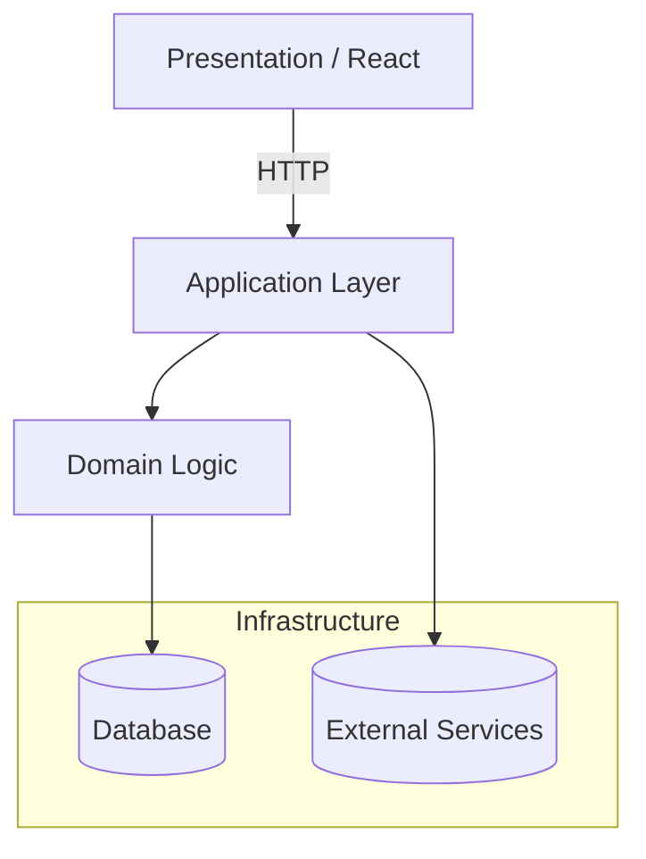
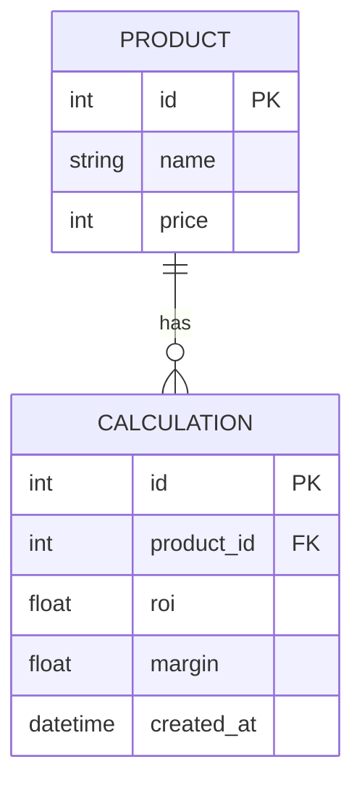

# Архитектура проекта

## 🗂 Структура каталогов

```text
├─ app/
│  ├─ backend/        # API, контроллеры, middleware
│  ├─ frontend/       # React-клиент (Vite)
│  └─ shared/         # DTO, утилиты, типы, константы между слоями
├─ src/               # (исторический) исходный код, постепенно переносится в app/
├─ config/            # Конфигурации (.env, vite, tsconfig*)
├─ scripts/           # Node-скрипты (history, миграции, утилиты)
├─ tests/             # unit, integration, e2e
└─ docs/              # Документация (этот каталог)
```

## 🧩 Модули

| Модуль | Слой | Краткое описание |
|--------|------|------------------|
| `frontend` | presentation | React + Vite SPA, маршрутизация, UI |
| `backend` | application | REST API, обработка бизнес-логики |
| `core` | domain | Расчёты рентабельности, чистая логика |
| `db` | infrastructure | TypeORM, миграции, сиды |

### Зависимости


* Presentation ↔ Application через HTTP (`axios`)
* Application ↔ Domain через импорт функций
* Domain не зависит от внешних слоёв

## 🧩 Диаграмма слоёв (Clean Architecture)



## 🗺️ ERD Базы данных



> 📌 Диаграммы рендерятся автоматически в MkDocs Material.

## 🔄 Потоки данных

1. UI отправляет запрос `/api/v1/calculate`.
2. Backend валидирует вход, вызывает `core/calculateResults.ts`.
3. Возвращается JSON, фронт отображает.
4. Результат кешируется (`localStorage` / БД).

## 🗃 Хранение истории

История закрытых задач хранится в `.log/history/*.json` — см. [README_HISTORY.md](../README_HISTORY.md).
